# AI/ML Pipeline - Complete Neural Architecture

## 🤖 **AI/ML Pipeline Overview**

```mermaid
graph TB
    %% Input Layer
    USER_INPUT[👤 User Input] --> INPUT_PROCESSOR[📝 Input Processor]
    
    %% Core AI Hub
    INPUT_PROCESSOR --> ORIENTATOR_AI[🤖 Orientator AI Core]
    ORIENTATOR_AI --> TOOL_REGISTRY[🔨 Tool Registry Hub]
    
    %% Tool Registry Components
    TOOL_REGISTRY --> ESCO_TOOL[📊 ESCO Skills Tool]
    TOOL_REGISTRY --> CAREER_TREE_TOOL[🌳 Career Tree Tool]
    TOOL_REGISTRY --> OASIS_TOOL[🔍 OASIS Explorer Tool]
    TOOL_REGISTRY --> PEER_TOOL[🤝 Peer Matching Tool]
    TOOL_REGISTRY --> HEXACO_TOOL[🧠 HEXACO Assessment Tool]
    TOOL_REGISTRY --> HOLLAND_TOOL[🔍 Holland Test Tool]
    TOOL_REGISTRY --> XP_TOOL[⚡ XP Challenges Tool]
    
    %% LLM Services
    ORIENTATOR_AI --> LLM_CORE[🧠 LLM Core Services]
    LLM_CORE --> OPENAI_API[🌐 OpenAI API]
    LLM_CORE --> LLM_CAREER_ADVISOR[💼 Career Advisor LLM]
    LLM_CORE --> LLM_ANALYSIS[📊 Analysis LLM]
    LLM_CORE --> LLM_HEXACO[🧠 HEXACO LLM]
    LLM_CORE --> LLM_HOLLAND[🔍 Holland LLM]
    LLM_CORE --> LLM_COMPATIBILITY[🤝 Compatibility LLM]
    LLM_CORE --> LLM_COMPETENCE[🌿 Competence LLM]
    
    %% Embedding Services
    TOOL_REGISTRY --> EMBEDDING_LAYER[📊 Embedding Layer]
    EMBEDDING_LAYER --> ESCO_EMBEDDINGS[📈 ESCO Embeddings Service]
    EMBEDDING_LAYER --> OASIS_EMBEDDINGS[🔍 OASIS Embeddings Service]
    EMBEDDING_LAYER --> CUSTOM_EMBEDDINGS[⚡ Custom Embeddings]
    
    %% Neural Network Layer
    EMBEDDING_LAYER --> NEURAL_NETWORKS[🕸️ Neural Network Layer]
    NEURAL_NETWORKS --> GRAPHSAGE[🕸️ GraphSage Network]
    NEURAL_NETWORKS --> SENTENCE_TRANSFORMERS[📝 Sentence Transformers]
    NEURAL_NETWORKS --> FINETUNED_MODELS[🎯 Fine-tuned Models]
    
    %% Tree Generation Pipeline
    CAREER_TREE_TOOL --> TREE_GENERATION[🌳 Tree Generation Pipeline]
    TREE_GENERATION --> COMPETENCE_TREE_GEN[🌿 Competence Tree Generator]
    TREE_GENERATION --> OCCUPATION_TREE_GEN[💼 Occupation Tree Generator]
    TREE_GENERATION --> SKILLS_TREE_GEN[⚡ Skills Tree Generator]
    TREE_GENERATION --> CAREER_TREE_GEN[🎯 Career Tree Generator]
    
    %% Assessment Processing Pipeline
    HEXACO_TOOL --> ASSESSMENT_PIPELINE[📊 Assessment Pipeline]
    HOLLAND_TOOL --> ASSESSMENT_PIPELINE
    ASSESSMENT_PIPELINE --> HEXACO_PROCESSOR[🧠 HEXACO Processor]
    ASSESSMENT_PIPELINE --> HOLLAND_PROCESSOR[🔍 Holland Processor]
    ASSESSMENT_PIPELINE --> SCORING_ENGINE[📈 Scoring Engine]
    ASSESSMENT_PIPELINE --> PERSONALITY_ANALYZER[🎭 Personality Analyzer]
    
    %% Career Recommendation Pipeline
    OASIS_TOOL --> CAREER_REC_PIPELINE[🎯 Career Recommendation Pipeline]
    ESCO_TOOL --> CAREER_REC_PIPELINE
    CAREER_REC_PIPELINE --> SWIPE_REC_ENGINE[📱 Swipe Recommendation Engine]
    CAREER_REC_PIPELINE --> JOB_CARD_GENERATOR[💼 Job Card Generator]
    CAREER_REC_PIPELINE --> COMPATIBILITY_MATCHER[🤝 Compatibility Matcher]
    
    %% Peer Matching Pipeline
    PEER_TOOL --> PEER_PIPELINE[🤝 Peer Matching Pipeline]
    PEER_PIPELINE --> PEER_COMPATIBILITY[💫 Peer Compatibility Engine]
    PEER_PIPELINE --> SOCIAL_GRAPH[🌐 Social Graph Analysis]
    
    %% Data Processing Layer
    NEURAL_NETWORKS --> DATA_PROCESSING[🔄 Data Processing Layer]
    DATA_PROCESSING --> VECTOR_OPERATIONS[📊 Vector Operations]
    DATA_PROCESSING --> SIMILARITY_SEARCH[🔍 Similarity Search]
    DATA_PROCESSING --> GRAPH_TRAVERSAL[🗺️ Graph Traversal]
    DATA_PROCESSING --> PATTERN_RECOGNITION[🎯 Pattern Recognition]
    
    %% Knowledge Bases
    ESCO_EMBEDDINGS --> ESCO_KB[📚 ESCO Knowledge Base]
    OASIS_EMBEDDINGS --> OASIS_KB[💼 OASIS Knowledge Base]
    TREE_GENERATION --> CAREER_KB[🎯 Career Knowledge Base]
    
    %% Memory & Context
    ORIENTATOR_AI --> MEMORY_SYSTEM[🧠 Memory System]
    MEMORY_SYSTEM --> CONVERSATION_MEMORY[💬 Conversation Memory]
    MEMORY_SYSTEM --> USER_CONTEXT[👤 User Context]
    MEMORY_SYSTEM --> SESSION_STATE[🔄 Session State]
    
    %% Output Processing
    TOOL_REGISTRY --> OUTPUT_PROCESSOR[📤 Output Processor]
    OUTPUT_PROCESSOR --> RESPONSE_FORMATTER[📝 Response Formatter]
    OUTPUT_PROCESSOR --> COMPONENT_GENERATOR[🧩 Component Generator]
    
    %% Response Types
    RESPONSE_FORMATTER --> TEXT_RESPONSES[📝 Text Responses]
    RESPONSE_FORMATTER --> STRUCTURED_RESPONSES[🏗️ Structured Responses]
    COMPONENT_GENERATOR --> CAREER_CARDS[💼 Career Cards]
    COMPONENT_GENERATOR --> SKILL_TREES[🌳 Skill Trees]
    COMPONENT_GENERATOR --> TEST_RESULTS[📊 Test Results]
    COMPONENT_GENERATOR --> PEER_SUGGESTIONS[🤝 Peer Suggestions]
    
    %% Integration Points
    GRAPHSAGE --> GRAPHSAGE_LLM_INTEGRATION[🔗 GraphSage-LLM Integration]
    ESCO_EMBEDDINGS --> ESCO_INTEGRATION[🔗 ESCO Integration Service]
    ESCO_INTEGRATION --> ESCO_FORMATTING[📝 ESCO Formatting Service]
    
    %% Model Storage
    NEURAL_NETWORKS --> MODEL_STORAGE[💾 Model Storage]
    MODEL_STORAGE --> FINETUNED_MODEL_FILES[📁 Fine-tuned Model Files]
    MODEL_STORAGE --> GRAPHSAGE_WEIGHTS[⚖️ GraphSage Weights]
    MODEL_STORAGE --> EMBEDDING_INDEXES[📇 Embedding Indexes]
    
    %% Performance Monitoring
    ORIENTATOR_AI --> PERFORMANCE_MONITOR[📊 Performance Monitor]
    PERFORMANCE_MONITOR --> LATENCY_TRACKER[⏱️ Latency Tracker]
    PERFORMANCE_MONITOR --> ACCURACY_METRICS[🎯 Accuracy Metrics]
    PERFORMANCE_MONITOR --> USAGE_ANALYTICS[📈 Usage Analytics]
    
    classDef ai_core fill:#fff3e0,stroke:#e65100,stroke-width:3px
    classDef tools fill:#e8f5e8,stroke:#1b5e20,stroke-width:2px
    classDef llm fill:#f3e5f5,stroke:#4a148c,stroke-width:2px
    classDef neural fill:#e3f2fd,stroke:#0d47a1,stroke-width:2px
    classDef processing fill:#fce4ec,stroke:#880e4f,stroke-width:2px
    classDef storage fill:#f1f8e9,stroke:#33691e,stroke-width:2px
    
    class ORIENTATOR_AI,TOOL_REGISTRY ai_core
    class ESCO_TOOL,CAREER_TREE_TOOL,OASIS_TOOL,PEER_TOOL,HEXACO_TOOL,HOLLAND_TOOL,XP_TOOL tools
    class LLM_CORE,OPENAI_API,LLM_CAREER_ADVISOR,LLM_ANALYSIS,LLM_HEXACO,LLM_HOLLAND,LLM_COMPATIBILITY,LLM_COMPETENCE llm
    class NEURAL_NETWORKS,GRAPHSAGE,SENTENCE_TRANSFORMERS,FINETUNED_MODELS neural
    class DATA_PROCESSING,VECTOR_OPERATIONS,SIMILARITY_SEARCH,GRAPH_TRAVERSAL,PATTERN_RECOGNITION processing
    class MODEL_STORAGE,FINETUNED_MODEL_FILES,GRAPHSAGE_WEIGHTS,EMBEDDING_INDEXES storage
```

## 🧠 **Core AI Components**

### **Orientator AI Service** (orientator_ai_service.py)
- **Primary Function**: Central conversational AI engine
- **Responsibilities**: Intent analysis, tool selection, response generation
- **Integration**: OpenAI GPT models with custom tool calling
- **Features**: Context management, multi-turn conversations, streaming responses

### **Tool Registry** (tool_registry.py)
- **Primary Function**: AI tool management and orchestration
- **Available Tools**:
  - `esco_skills` - Skills analysis and matching
  - `career_tree` - Career path generation
  - `oasis_explorer` - Job discovery and exploration
  - `peer_matching` - Peer network analysis
  - `hexaco_test` - Personality assessment
  - `holland_test` - Interest assessment
  - `xp_challenges` - Skill development challenges

## 🕸️ **Neural Network Architecture**

### **GraphSage Neural Network** (GraphSage.py)
- **Architecture**: Graph neural network for career relationship modeling
- **Purpose**: Learning embeddings for skills, careers, and competencies
- **Features**: 
  - Inductive learning on career graphs
  - Multi-hop neighborhood aggregation
  - Dynamic graph updates
- **Integration**: LLM integration for enhanced reasoning

### **Embedding Services**

#### **ESCO Embeddings** (esco_embedding_service384.py)
- **Dimension**: 384-dimensional vectors
- **Coverage**: 13,000+ skills from ESCO taxonomy
- **Features**: Hierarchical skill relationships, multi-language support
- **Usage**: Skill matching, competency analysis, career alignment

#### **OASIS Embeddings** (Oasisembedding_service.py)
- **Coverage**: Job market data and career descriptions
- **Features**: Real-time job market analysis, salary trends
- **Integration**: Labor market intelligence integration

#### **Custom Embeddings**
- **User Representations**: Personalized user profile vectors
- **Conversation Embeddings**: Chat context and intent vectors
- **Assessment Embeddings**: Personality and interest vectors

### **Fine-tuned Models**
- **Location**: `/backend/app/models/finetuned_model/`
- **Components**:
  - `model.safetensors` - Model weights
  - `config.json` - Model configuration
  - `tokenizer.json` - Custom tokenizer
  - `sentence_bert_config.json` - BERT configuration

## 🌳 **Tree Generation Pipeline**

### **Competence Tree Generator** (competenceTree.py)
- **Function**: Generates interactive competence trees
- **Algorithm**: Graph traversal with skill dependency analysis
- **Features**: Dynamic depth control, alternative path discovery
- **Integration**: GraphSage neural network for relationship scoring

### **Career Tree Generator** (LLMcareerTree.py)
- **Function**: LLM-powered career progression paths
- **Features**: Personalized career trajectories, skill gap analysis
- **Integration**: OpenAI GPT with custom prompting

### **Skills Tree Generator** (LLMskillsTree.py)
- **Function**: Skill development pathways
- **Features**: Learning sequence optimization, prerequisite mapping
- **Algorithm**: Topological sorting with difficulty weighting

### **Occupation Tree Generator** (occupationTree.py)
- **Function**: Job family and occupation hierarchies
- **Data Source**: ESCO occupation taxonomy
- **Features**: Career transition analysis, job similarity scoring

## 📊 **Assessment Processing Pipeline**

### **HEXACO Processor** (LLMhexaco_service.py)
- **Model**: HEXACO-PI-R personality assessment
- **Dimensions**: 6 major factors, 24 facets
- **Features**: LLM-enhanced interpretation, narrative generation
- **Output**: Personality profiles with career implications

### **Holland Processor** (LLMholland_service.py)
- **Model**: Holland Code (RIASEC) interest assessment
- **Types**: Realistic, Investigative, Artistic, Social, Enterprising, Conventional
- **Features**: Career environment matching, interest-skill alignment
- **Integration**: Career recommendation weighting

### **Scoring Engine** (hexaco_scoring_service.py)
- **Algorithms**: Psychometric scoring with reliability analysis
- **Features**: Confidence intervals, response pattern analysis
- **Quality Control**: Response validity checks, bias detection

## 🎯 **Career Recommendation Pipeline**

### **Swipe Recommendation Engine** (Swipe_career_recommendation_service.py)
- **Algorithm**: Multi-factor recommendation scoring
- **Features**: Tinder-like interface, machine learning preference updates
- **Factors**: Skills match, personality fit, market demand, salary alignment

### **Job Card Generator** (job_card_llm_service.py)
- **Function**: AI-generated job descriptions and requirements
- **Features**: Personalized job cards, skill gap highlighting
- **Data Sources**: ESCO, OASIS, real-time job market data

### **Compatibility Matcher** (LLMcompatibility_service.py)
- **Algorithm**: Multi-dimensional compatibility scoring
- **Dimensions**: Skills, personality, interests, values, work environment
- **Output**: Compatibility scores with explanations

## 🤝 **Peer Matching Pipeline**

### **Peer Compatibility Engine** (peer_matching_service.py)
- **Algorithm**: Graph-based similarity with machine learning
- **Features**: Shared interests discovery, complementary skills analysis
- **Privacy**: Anonymized matching with consent-based connections

### **Social Graph Analysis**
- **Function**: Network analysis for peer recommendations
- **Features**: Community detection, influence scoring, collaboration potential
- **Integration**: Career network building, mentorship matching

## 🔄 **Data Processing Layer**

### **Vector Operations**
- **Similarity Search**: Cosine similarity, Euclidean distance
- **Clustering**: K-means, hierarchical clustering for user segmentation
- **Dimensionality Reduction**: PCA, t-SNE for visualization

### **Graph Traversal**
- **Algorithms**: Breadth-first search, Dijkstra for shortest paths
- **Features**: Multi-hop reasoning, path optimization
- **Applications**: Career progression planning, skill development paths

### **Pattern Recognition**
- **User Behavior**: Session patterns, interaction analysis
- **Career Trends**: Market analysis, emerging skill demands
- **Assessment Patterns**: Response analysis, bias detection

## 🧠 **Memory & Context Management**

### **Conversation Memory**
- **Storage**: Session-based and persistent conversation history
- **Features**: Context window management, topic tracking
- **Integration**: Long-term user modeling, preference learning

### **User Context**
- **Components**: Current goals, recent activities, assessment results
- **Features**: Dynamic context updates, relevance scoring
- **Applications**: Personalized recommendations, adaptive interfaces

## 📤 **Output Processing**

### **Response Formatter**
- **Types**: Text responses, structured data, component specifications
- **Features**: Markdown formatting, rich media embedding
- **Integration**: Frontend component rendering

### **Component Generator**
- **Career Cards**: Job recommendations with interactive elements
- **Skill Trees**: Interactive tree visualizations
- **Test Results**: Assessment result displays with insights
- **Peer Suggestions**: Social network recommendations

## 📊 **Performance Monitoring**

### **Latency Tracking**
- **Metrics**: Response times, processing delays, model inference speed
- **Targets**: <2s for simple queries, <5s for complex analysis
- **Optimization**: Caching, model quantization, async processing

### **Accuracy Metrics**
- **Assessment Reliability**: Cronbach's alpha, test-retest reliability
- **Recommendation Accuracy**: Click-through rates, user satisfaction
- **Model Performance**: Precision, recall, F1 scores

### **Usage Analytics**
- **Tool Usage**: Frequency, success rates, user feedback
- **Feature Adoption**: A/B testing, usage patterns
- **System Health**: Error rates, availability, scalability metrics

## 🔗 **Integration Architecture**

### **GraphSage-LLM Integration** (graphsage_llm_integration.py)
- **Purpose**: Combining graph neural networks with language models
- **Features**: Graph-informed text generation, structural reasoning
- **Applications**: Career path explanation, skill relationship analysis

### **ESCO Integration** (esco_integration_service.py)
- **Function**: Real-time ESCO taxonomy integration
- **Features**: Taxonomy updates, multi-language support
- **Data Pipeline**: ETL processes, data validation, version control

This AI/ML pipeline provides sophisticated intelligence capabilities for the Orientor platform, combining multiple neural networks, language models, and specialized algorithms to deliver personalized career guidance and insights.