# Orientor Platform - Complete Architecture Documentation

## 🎯 **Platform Overview**
Orientor is an AI-driven career guidance and skills development platform that combines psychological assessments, career recommendations, and interactive skill trees to guide users through their professional journey.

## 📊 **Master System Architecture**

```mermaid
graph TB
    %% External Layer
    User[👤 User Browser] --> LB[🌐 Load Balancer]
    LB --> FE[📱 Frontend - Next.js 13+]
    
    %% Frontend Layer
    FE --> |Static Assets| CDN[📦 CDN - Vercel]
    FE --> |API Calls| API[🔧 API Gateway - FastAPI]
    
    %% API Gateway Layer
    API --> |Authentication| AUTH[🔐 Auth Service]
    API --> |Chat/AI| CHAT[💬 Chat Services]
    API --> |Career/Skills| CAREER[🌳 Career Services]
    API --> |Education| EDU[🎓 Education Services]
    API --> |Social| SOCIAL[👥 Social Services]
    API --> |Assessment| ASSESS[📊 Assessment Services]
    
    %% Authentication
    AUTH --> JWT[🎫 JWT Manager]
    AUTH --> RBAC[🛡️ RBAC System]
    
    %% Core Services
    CHAT --> AI[🤖 Orientator AI]
    CAREER --> TREE[🌲 Tree Generation]
    CAREER --> REC[🎯 Recommendations]
    EDU --> PROG[📚 Program Matching]
    SOCIAL --> PEER[🤝 Peer Matching]
    ASSESS --> HEXACO[🧠 HEXACO Test]
    ASSESS --> HOLLAND[🔍 Holland Test]
    
    %% AI/ML Pipeline
    AI --> TOOLS[🔨 Tool Registry]
    AI --> LLM[🧠 OpenAI LLM]
    TOOLS --> ESCO[📊 ESCO Embeddings]
    TOOLS --> OASIS[🔍 OASIS Search]
    TOOLS --> GNN[🕸️ GraphSage Neural Network]
    
    %% Database Layer
    AUTH --> DB[(🗄️ PostgreSQL Database)]
    CHAT --> DB
    CAREER --> DB
    EDU --> DB
    SOCIAL --> DB
    ASSESS --> DB
    
    %% Database Components
    DB --> USERS[👥 Users & Profiles]
    DB --> CONV[💬 Conversations]
    DB --> SKILLS[⚡ Skills & Trees]
    DB --> COURSES[📖 Courses & Programs]
    DB --> ANALYTICS[📈 Analytics]
    
    %% External Integrations
    AI --> OPENAI[🌐 OpenAI API]
    PROG --> SCHOOL_API[🏫 School APIs]
    CDN --> ASSETS[📁 Static Assets]
    
    %% Deployment Infrastructure
    API --> RAILWAY[🚂 Railway Platform]
    FE --> VERCEL[▲ Vercel Platform]
    DB --> RAILWAY_DB[🗄️ Railway PostgreSQL]
    
    %% Monitoring & Logging
    API --> LOGS[📋 Application Logs]
    FE --> ANALYTICS_V[📊 Vercel Analytics]
    
    %% Cache Layer
    API --> CACHE[⚡ Redis Cache]
    
    classDef frontend fill:#e1f5fe,stroke:#01579b,stroke-width:2px
    classDef backend fill:#f3e5f5,stroke:#4a148c,stroke-width:2px
    classDef database fill:#e8f5e8,stroke:#1b5e20,stroke-width:2px
    classDef ai fill:#fff3e0,stroke:#e65100,stroke-width:2px
    classDef external fill:#fce4ec,stroke:#880e4f,stroke-width:2px
    classDef infra fill:#f1f8e9,stroke:#33691e,stroke-width:2px
    
    class FE,CDN frontend
    class API,AUTH,CHAT,CAREER,EDU,SOCIAL,ASSESS,JWT,RBAC,TREE,REC,PROG,PEER,HEXACO,HOLLAND backend
    class DB,USERS,CONV,SKILLS,COURSES,ANALYTICS,RAILWAY_DB database
    class AI,TOOLS,LLM,ESCO,OASIS,GNN ai
    class OPENAI,SCHOOL_API external
    class RAILWAY,VERCEL,LOGS,ANALYTICS_V,CACHE infra
```

## 🏗️ **Technology Stack**

### **Frontend Stack**
- **Framework**: Next.js 13+ (App Router)
- **Language**: TypeScript
- **Styling**: Tailwind CSS, CSS Modules
- **State**: Zustand, Context API
- **UI Components**: Custom components, Radix UI
- **Animation**: Framer Motion
- **Charts**: Chart.js, Recharts
- **Icons**: Lucide React, Heroicons

### **Backend Stack**
- **Framework**: FastAPI (Python)
- **Database**: PostgreSQL
- **ORM**: SQLAlchemy
- **Migrations**: Alembic
- **Authentication**: JWT
- **AI/ML**: OpenAI, Custom Neural Networks
- **Embeddings**: ESCO, OASIS, Custom models
- **Deployment**: Railway (optimized)

### **AI/ML Stack**
- **Language Models**: OpenAI GPT
- **Neural Networks**: GraphSage, Custom PyTorch models
- **Embeddings**: Sentence Transformers, Custom embeddings
- **Vector Search**: Custom implementation
- **Graph Processing**: NetworkX, Custom algorithms

## 🎯 **Key Features**

1. **🎯 Career Guidance**: AI-powered career recommendations based on skills, personality, and interests
2. **🌳 Interactive Skill Trees**: Dynamic visualization of career paths and skill relationships
3. **🧠 Psychological Assessments**: HEXACO and Holland Code implementations
4. **💬 Intelligent Chat**: Multi-modal chat with tool integration and memory
5. **🎓 Education Integration**: School program recommendations and course analysis
6. **👥 Peer Network**: AI-powered peer matching and social features
7. **📊 Progress Tracking**: Comprehensive user journey and milestone tracking
8. **🔍 Vector Search**: Advanced search across careers, skills, and programs

---

*For detailed component documentation, see the specific architecture files in this directory.*