# Data Flow Diagrams - User Journeys & System Interactions

## 🔄 **Core System Data Flows**

### **User Onboarding Flow**

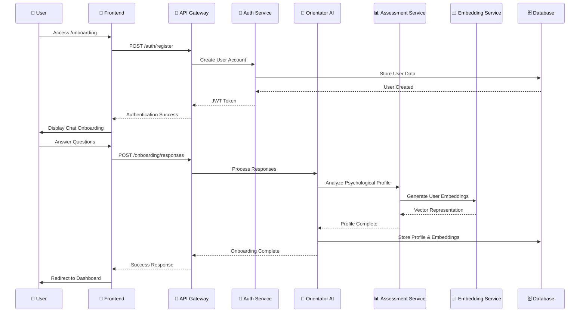

### **Career Recommendation Flow**

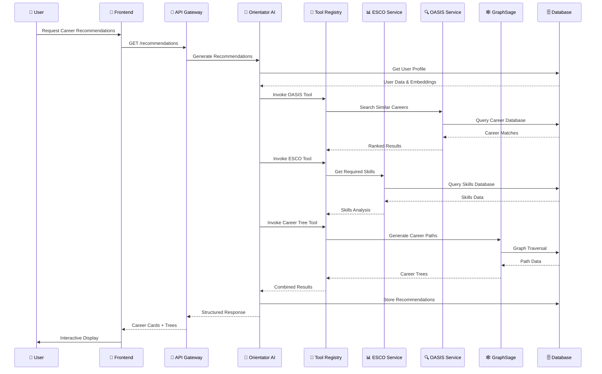

### **Assessment Processing Flow**

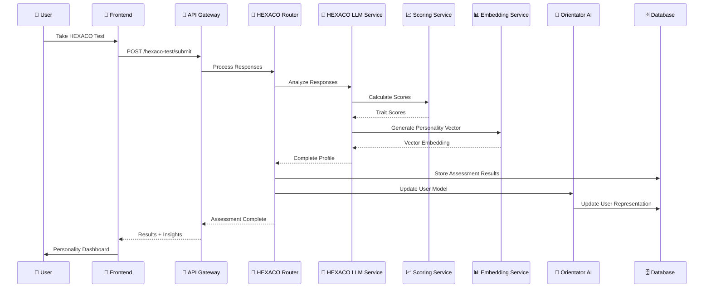

### **Interactive Tree Navigation Flow**

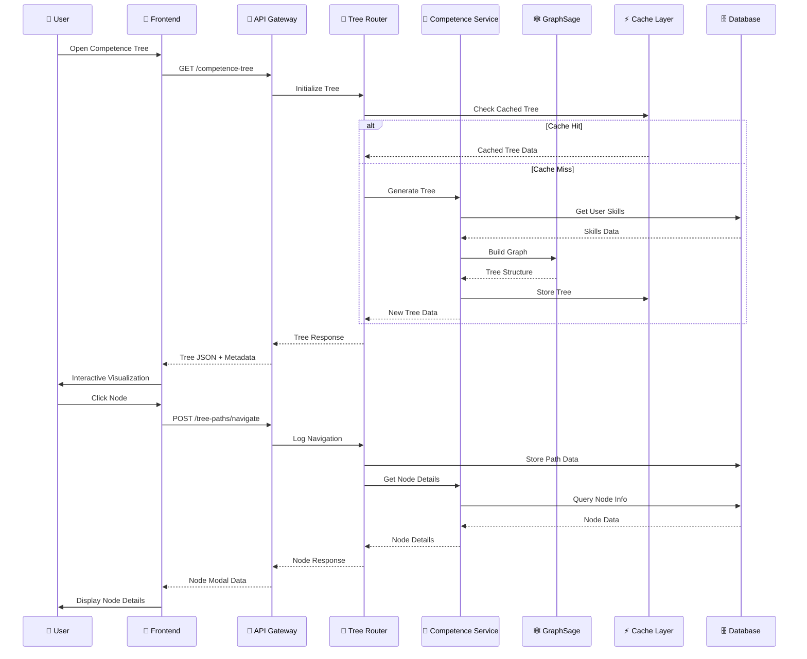

### **Chat Intelligence Flow**

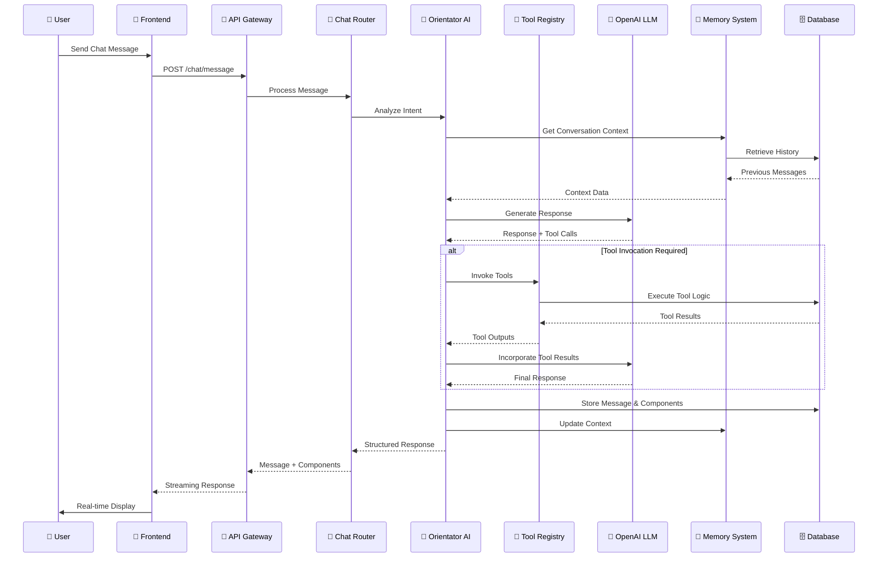

## 🎓 **Education Integration Flow**

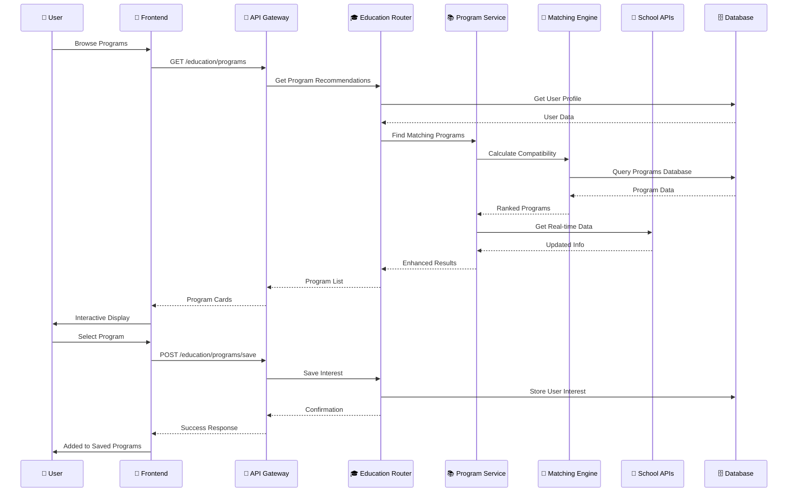

## 👥 **Peer Matching Flow**

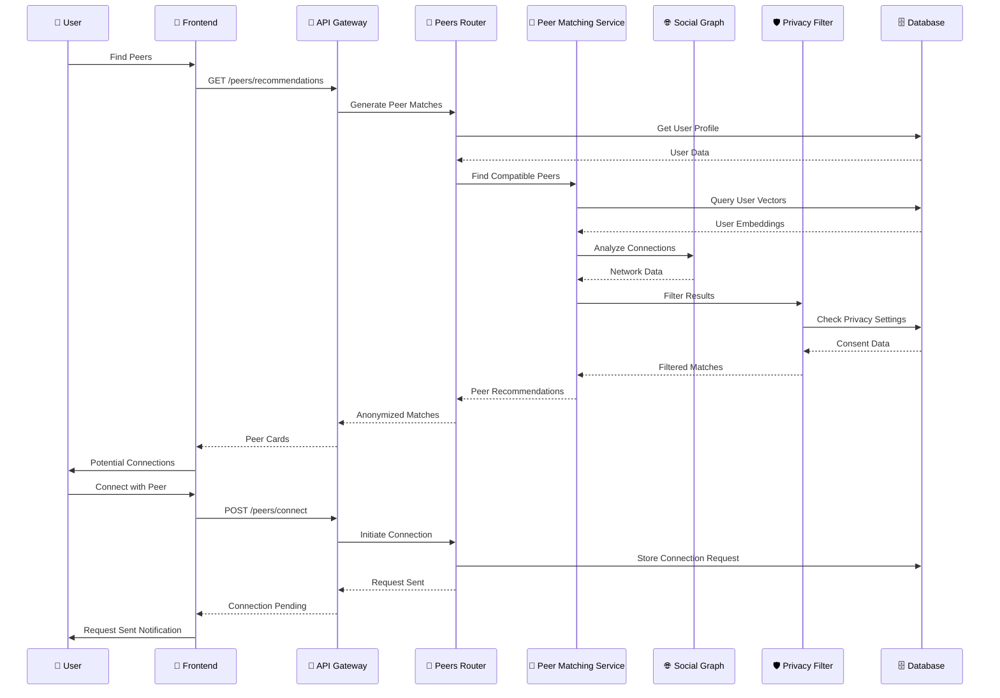

## 📊 **Real-time Analytics Flow**

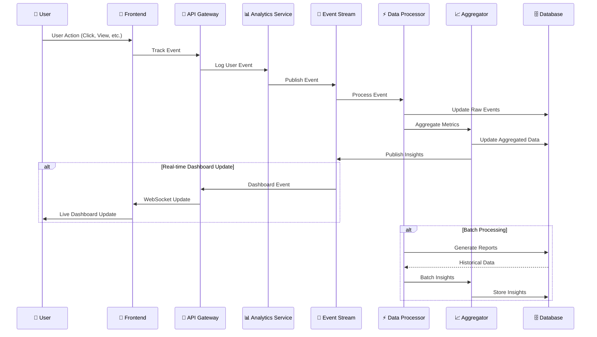

## 🔍 **Vector Search Flow**

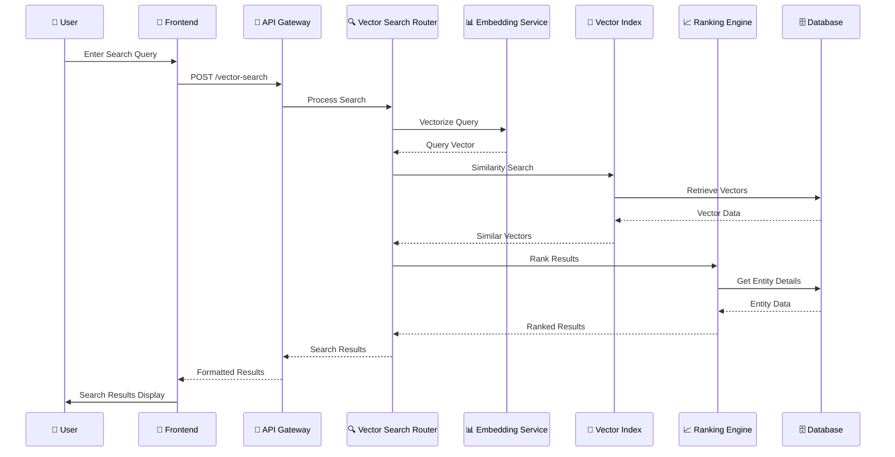

## 🔄 **System Health Monitoring Flow**

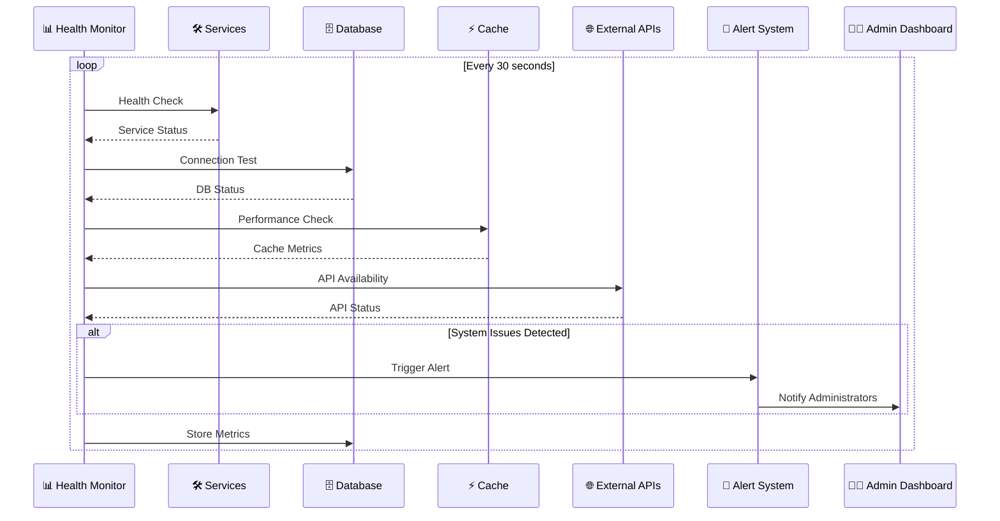

## 🔄 **Data Synchronization Flow**

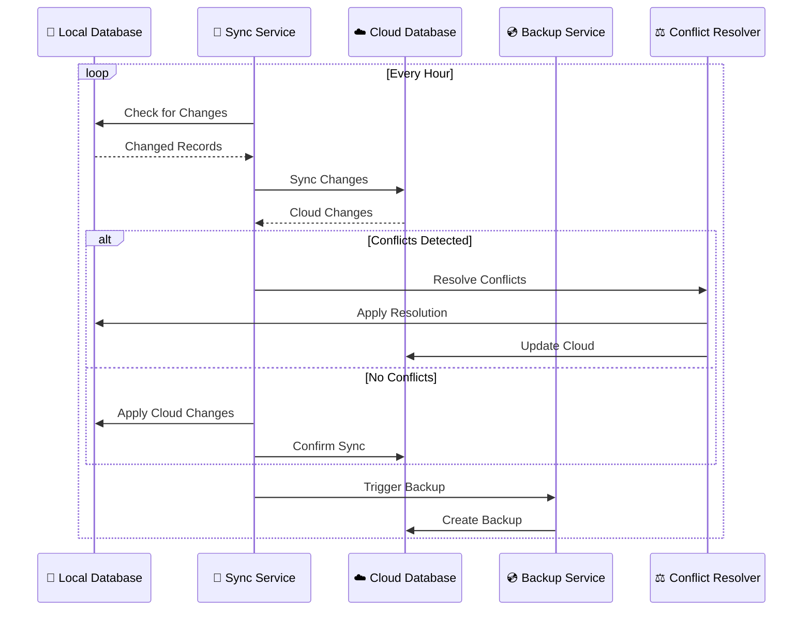

These data flow diagrams illustrate the complete system interactions and user journeys throughout the Orientor platform, showing how data moves between components and how various services collaborate to deliver the user experience.