# Database Schema - Complete Entity Relationship Mapping

## 🗄️ **Complete Database Schema**

```mermaid
erDiagram
    %% Core User System
    USERS {
        int id PK
        string email UK
        string hashed_password
        datetime created_at
        boolean onboarding_completed
    }
    
    USER_PROFILES {
        int id PK
        int user_id FK
        string first_name
        string last_name
        date date_of_birth
        string education_level
        string current_role
        string industry
        json preferences
        datetime created_at
        datetime updated_at
    }
    
    USER_SKILLS {
        int id PK
        int user_id FK
        json skills_data
        json competencies
        float confidence_score
        datetime assessed_at
        datetime updated_at
    }
    
    USER_REPRESENTATIONS {
        int id PK
        int user_id FK
        json vector_embedding
        string representation_type
        json metadata
        datetime created_at
        datetime updated_at
    }
    
    USER_PROGRESS {
        int id PK
        int user_id FK
        json milestones
        int completion_percentage
        json current_goals
        json achievements
        datetime last_activity
        datetime created_at
    }
    
    USER_NOTES {
        int id PK
        int user_id FK
        string title
        text content
        string category
        json tags
        datetime created_at
        datetime updated_at
    }
    
    %% Chat & Communication System
    CONVERSATIONS {
        int id PK
        int user_id FK
        string title
        string conversation_type
        json metadata
        boolean is_shared
        datetime created_at
        datetime updated_at
    }
    
    MESSAGES {
        int id PK
        int conversation_id FK
        string sender_type
        text content
        json metadata
        datetime timestamp
        boolean is_edited
    }
    
    CHAT_MESSAGES {
        int id PK
        int conversation_id FK
        string role
        text content
        json tool_calls
        json metadata
        datetime created_at
    }
    
    MESSAGE_COMPONENTS {
        int id PK
        int message_id FK
        string component_type
        json component_data
        json actions
        int display_order
        datetime created_at
    }
    
    CONVERSATION_CATEGORIES {
        int id PK
        int user_id FK
        string name
        string description
        string color
        datetime created_at
    }
    
    CONVERSATION_SHARES {
        int id PK
        int conversation_id FK
        int user_id FK
        string share_token
        boolean is_public
        datetime expires_at
        datetime created_at
    }
    
    USER_CHAT_ANALYTICS {
        int id PK
        int user_id FK
        int total_conversations
        int total_messages
        float avg_session_duration
        json interaction_patterns
        datetime last_updated
    }
    
    %% Career & Skills System
    CAREER_GOALS {
        int id PK
        int user_id FK
        string title
        text description
        string status
        string priority
        date target_date
        json milestones
        datetime created_at
        datetime updated_at
    }
    
    SAVED_RECOMMENDATIONS {
        int id PK
        int user_id FK
        string recommendation_type
        json recommendation_data
        json cognitive_traits
        float compatibility_score
        text user_notes
        datetime saved_at
    }
    
    TREE_PATHS {
        int id PK
        int user_id FK
        string path_type
        json path_data
        json navigation_history
        datetime created_at
        datetime updated_at
    }
    
    NODE_NOTES {
        int id PK
        int user_id FK
        string node_id
        string node_type
        text content
        json metadata
        datetime created_at
        datetime updated_at
    }
    
    USER_RECOMMENDATIONS {
        int id PK
        int user_id FK
        string recommendation_type
        json recommendation_data
        float score
        string status
        datetime created_at
    }
    
    USER_SKILL_TREES {
        int id PK
        int user_id FK
        string tree_type
        json tree_data
        json progress
        datetime created_at
        datetime updated_at
    }
    
    %% Assessment System
    PERSONALITY_ASSESSMENTS {
        int id PK
        string assessment_type
        json questions
        json scoring_rules
        boolean is_active
        datetime created_at
    }
    
    PERSONALITY_PROFILES {
        int id PK
        int user_id FK
        string assessment_type
        json scores
        json traits
        text narrative_description
        float confidence_level
        datetime assessed_at
    }
    
    STRENGTHS_REFLECTION_RESPONSES {
        int id PK
        int user_id FK
        string question_id
        text response
        json metadata
        datetime created_at
    }
    
    SUGGESTED_PEERS {
        int id PK
        int user_id FK
        int suggested_user_id FK
        float compatibility_score
        json shared_interests
        string match_reason
        string status
        datetime created_at
    }
    
    %% Education System
    COURSES {
        int id PK
        int user_id FK
        string course_name
        string institution
        string level
        text description
        json skills_covered
        string status
        date start_date
        date end_date
        datetime created_at
    }
    
    SCHOOL_PROGRAMS {
        int id PK
        string program_name
        string institution
        string degree_type
        text description
        json requirements
        json career_outcomes
        string location
        float duration_years
        datetime created_at
    }
    
    PSYCHOLOGICAL_INSIGHTS {
        int id PK
        int user_id FK
        string insight_type
        text content
        json metadata
        float confidence_score
        datetime generated_at
    }
    
    CAREER_SIGNALS {
        int id PK
        int user_id FK
        string signal_type
        json signal_data
        float strength
        string source
        datetime detected_at
    }
    
    CONVERSATION_LOGS {
        int id PK
        int user_id FK
        json conversation_data
        string analysis_type
        json insights
        datetime created_at
    }
    
    CAREER_PROFILE_AGGREGATES {
        int id PK
        int user_id FK
        json profile_summary
        json skill_gaps
        json career_trajectories
        datetime updated_at
    }
    
    %% AI System
    TOOL_INVOCATIONS {
        int id PK
        int user_id FK
        string tool_name
        json input_data
        json output_data
        string status
        float execution_time
        datetime invoked_at
    }
    
    USER_JOURNEY_MILESTONES {
        int id PK
        int user_id FK
        string milestone_type
        string milestone_name
        json milestone_data
        datetime achieved_at
        datetime created_at
    }
    
    %% Relationships
    USERS ||--o{ USER_PROFILES : has
    USERS ||--o{ USER_SKILLS : has
    USERS ||--o{ USER_REPRESENTATIONS : has
    USERS ||--o{ USER_PROGRESS : has
    USERS ||--o{ USER_NOTES : creates
    USERS ||--o{ CONVERSATIONS : owns
    USERS ||--o{ CONVERSATION_CATEGORIES : creates
    USERS ||--o{ CONVERSATION_SHARES : shares
    USERS ||--o{ USER_CHAT_ANALYTICS : has
    USERS ||--o{ CAREER_GOALS : sets
    USERS ||--o{ SAVED_RECOMMENDATIONS : saves
    USERS ||--o{ TREE_PATHS : navigates
    USERS ||--o{ NODE_NOTES : annotates
    USERS ||--o{ USER_RECOMMENDATIONS : receives
    USERS ||--o{ USER_SKILL_TREES : builds
    USERS ||--o{ PERSONALITY_PROFILES : completes
    USERS ||--o{ STRENGTHS_REFLECTION_RESPONSES : provides
    USERS ||--o{ SUGGESTED_PEERS : matched_with
    USERS ||--o{ COURSES : takes
    USERS ||--o{ PSYCHOLOGICAL_INSIGHTS : receives
    USERS ||--o{ CAREER_SIGNALS : generates
    USERS ||--o{ CONVERSATION_LOGS : creates
    USERS ||--o{ CAREER_PROFILE_AGGREGATES : has
    USERS ||--o{ TOOL_INVOCATIONS : triggers
    USERS ||--o{ USER_JOURNEY_MILESTONES : achieves
    
    CONVERSATIONS ||--o{ MESSAGES : contains
    CONVERSATIONS ||--o{ CHAT_MESSAGES : includes
    MESSAGES ||--o{ MESSAGE_COMPONENTS : composed_of
    PERSONALITY_ASSESSMENTS ||--o{ PERSONALITY_PROFILES : generates
    USERS ||--o{ SUGGESTED_PEERS : suggests "suggested_user_id"
```

## 📊 **Table Details & Specifications**

### **Core User Tables**

#### **USERS** (Central Hub - 50+ Relationships)
- **Primary Key**: `id` (auto-increment)
- **Unique Constraints**: `email`
- **Indexes**: `email`, `created_at`
- **Key Relationships**: Connected to all major system components

#### **USER_PROFILES** (Demographics & Preferences)
- **Foreign Key**: `user_id` → USERS.id
- **Nullable Fields**: `first_name`, `last_name`, `date_of_birth`
- **JSON Fields**: `preferences` (user settings and preferences)

#### **USER_SKILLS** (Skill Assessments)
- **Foreign Key**: `user_id` → USERS.id
- **JSON Fields**: `skills_data` (skill inventory), `competencies` (assessed competencies)
- **Indexes**: `user_id`, `assessed_at`

#### **USER_REPRESENTATIONS** (AI Embeddings)
- **Foreign Key**: `user_id` → USERS.id
- **JSON Fields**: `vector_embedding` (high-dimensional vectors), `metadata` (embedding context)
- **Types**: Skills, personality, career preferences embeddings

#### **USER_PROGRESS** (Journey Tracking)
- **Foreign Key**: `user_id` → USERS.id
- **JSON Fields**: `milestones`, `current_goals`, `achievements`
- **Computed Fields**: `completion_percentage`

### **Communication System Tables**

#### **CONVERSATIONS** (Chat Containers)
- **Foreign Key**: `user_id` → USERS.id
- **Types**: `general`, `career_advice`, `assessment`, `peer_chat`
- **JSON Fields**: `metadata` (conversation context)

#### **MESSAGES** (Basic Messages)
- **Foreign Key**: `conversation_id` → CONVERSATIONS.id
- **Sender Types**: `user`, `system`, `ai`, `peer`
- **Indexes**: `conversation_id`, `timestamp`

#### **CHAT_MESSAGES** (Enhanced AI Messages)
- **Foreign Key**: `conversation_id` → CONVERSATIONS.id
- **JSON Fields**: `tool_calls` (AI tool invocations), `metadata`
- **Roles**: `user`, `assistant`, `system`

#### **MESSAGE_COMPONENTS** (Structured Message Parts)
- **Foreign Key**: `message_id` → MESSAGES.id
- **Component Types**: `text`, `career_card`, `skill_tree`, `assessment_result`
- **JSON Fields**: `component_data`, `actions`

### **Career & Skills System Tables**

#### **CAREER_GOALS** (User Objectives)
- **Foreign Key**: `user_id` → USERS.id
- **Status Values**: `active`, `completed`, `paused`, `archived`
- **Priority Levels**: `low`, `medium`, `high`, `critical`

#### **SAVED_RECOMMENDATIONS** (Bookmarked Items)
- **Foreign Key**: `user_id` → USERS.id
- **Types**: `career`, `skill`, `course`, `peer`
- **JSON Fields**: `recommendation_data`, `cognitive_traits`

#### **TREE_PATHS** (Navigation History)
- **Foreign Key**: `user_id` → USERS.id
- **Path Types**: `competence`, `career`, `skill`
- **JSON Fields**: `path_data`, `navigation_history`

#### **NODE_NOTES** (User Annotations)
- **Foreign Key**: `user_id` → USERS.id
- **Node Types**: `skill`, `career`, `competence`
- **Indexes**: `user_id`, `node_id`

### **Assessment System Tables**

#### **PERSONALITY_ASSESSMENTS** (Test Definitions)
- **Assessment Types**: `hexaco`, `holland`, `big5`, `custom`
- **JSON Fields**: `questions`, `scoring_rules`
- **Status**: `is_active` for version control

#### **PERSONALITY_PROFILES** (Test Results)
- **Foreign Key**: `user_id` → USERS.id
- **JSON Fields**: `scores` (raw scores), `traits` (interpreted traits)
- **Computed**: `narrative_description` (AI-generated)

#### **SUGGESTED_PEERS** (Peer Matching)
- **Foreign Keys**: `user_id` → USERS.id, `suggested_user_id` → USERS.id
- **JSON Fields**: `shared_interests`
- **Status Values**: `pending`, `accepted`, `declined`, `blocked`

### **Education System Tables**

#### **COURSES** (User Courses)
- **Foreign Key**: `user_id` → USERS.id
- **JSON Fields**: `skills_covered`
- **Status Values**: `planned`, `in_progress`, `completed`, `dropped`

#### **SCHOOL_PROGRAMS** (Available Programs)
- **JSON Fields**: `requirements`, `career_outcomes`
- **Indexes**: `institution`, `degree_type`, `location`

### **AI System Tables**

#### **TOOL_INVOCATIONS** (AI Tool Usage)
- **Foreign Key**: `user_id` → USERS.id
- **Tool Names**: `esco_skills`, `career_tree`, `oasis_explorer`, etc.
- **JSON Fields**: `input_data`, `output_data`
- **Performance**: `execution_time` tracking

#### **USER_JOURNEY_MILESTONES** (AI-Tracked Progress)
- **Foreign Key**: `user_id` → USERS.id
- **Milestone Types**: `onboarding_complete`, `first_assessment`, `career_goal_set`
- **JSON Fields**: `milestone_data`

## 🔗 **Relationship Mapping**

### **Primary Relationships**
- **USERS** serves as the central hub with connections to all major entities
- **CONVERSATIONS** → **MESSAGES** → **MESSAGE_COMPONENTS** (hierarchical chat structure)
- **USERS** → **PERSONALITY_PROFILES** ← **PERSONALITY_ASSESSMENTS** (assessment flow)
- **USERS** → **SUGGESTED_PEERS** → **USERS** (peer network graph)

### **Complex Relationships**
- **USER_REPRESENTATIONS** stores multiple vector embeddings per user (skills, personality, preferences)
- **TOOL_INVOCATIONS** tracks all AI interactions for analytics and improvement
- **CAREER_PROFILE_AGGREGATES** provides computed summaries for performance

### **Cascade Behaviors**
- User deletion cascades to all related records (GDPR compliance)
- Conversation deletion removes all messages and components
- Assessment deletion preserves user profiles (data retention)

## 📈 **Indexing Strategy**

### **Performance Indexes**
- **USERS**: `email`, `created_at`, `onboarding_completed`
- **MESSAGES**: `conversation_id`, `timestamp`, `sender_type`
- **PERSONALITY_PROFILES**: `user_id`, `assessment_type`, `assessed_at`
- **TOOL_INVOCATIONS**: `user_id`, `tool_name`, `invoked_at`
- **SAVED_RECOMMENDATIONS**: `user_id`, `recommendation_type`, `saved_at`

### **Search Indexes**
- **USER_PROFILES**: Full-text search on `first_name`, `last_name`
- **COURSES**: Full-text search on `course_name`, `institution`
- **SCHOOL_PROGRAMS**: Full-text search on `program_name`, `description`

## 🛡️ **Data Integrity Constraints**

### **Foreign Key Constraints**
- All user-related tables enforce foreign key relationships
- Cascade deletes for user data cleanup
- Restrict deletes for reference data preservation

### **Check Constraints**
- **PERSONALITY_PROFILES**: `confidence_level` BETWEEN 0 AND 1
- **SAVED_RECOMMENDATIONS**: `compatibility_score` BETWEEN 0 AND 1
- **USER_PROGRESS**: `completion_percentage` BETWEEN 0 AND 100

### **Unique Constraints**
- **USERS**: `email` (unique user identification)
- **CONVERSATION_SHARES**: `share_token` (unique sharing links)
- **USER_CHAT_ANALYTICS**: `user_id` (one analytics record per user)

This database schema provides a comprehensive foundation for the Orientor platform with proper normalization, efficient indexing, and robust relationship management.