# Frontend Architecture - Detailed Component Mapping

## 📱 **Frontend Architecture Overview**

```mermaid
graph TB
    %% Main App Structure
    APP[📱 Next.js App Router] --> LAYOUT[🎨 Root Layout]
    LAYOUT --> PROVIDERS[⚙️ Providers]
    LAYOUT --> FONTS[🔤 Custom Fonts]
    
    %% Core Pages Layer
    APP --> PAGES[📄 Core Pages - 25+ Routes]
    
    %% Authentication Pages
    PAGES --> AUTH_PAGES[🔐 Authentication]
    AUTH_PAGES --> LOGIN[📝 Login Page]
    AUTH_PAGES --> REGISTER[✨ Register Page]
    AUTH_PAGES --> ONBOARD[🚀 Onboarding Flow]
    
    %% Main Application Pages
    PAGES --> MAIN_PAGES[🏠 Main Application]
    MAIN_PAGES --> LANDING[🌟 Landing Page]
    MAIN_PAGES --> DASHBOARD[📊 Dashboard]
    MAIN_PAGES --> PROFILE[👤 Profile Management]
    
    %% Chat & Communication
    PAGES --> CHAT_PAGES[💬 Communication]
    CHAT_PAGES --> CHAT[💭 Chat Interface]
    CHAT_PAGES --> ENHANCED_CHAT[⚡ Enhanced Chat]
    CHAT_PAGES --> SOCRATIC[🤔 Socratic Chat]
    CHAT_PAGES --> MESSAGES[📨 Messages]
    CHAT_PAGES --> PEER_CHAT[👥 Peer Chat]
    
    %% Career & Skills
    PAGES --> CAREER_PAGES[🌳 Career & Skills]
    CAREER_PAGES --> COMPETENCE_TREE[🌲 Competence Tree]
    CAREER_PAGES --> CAREER_REC[🎯 Career Recommendations]
    CAREER_PAGES --> FIND_WAY[🧭 Find Your Way]
    CAREER_PAGES --> TREE_PATH[🛤️ Tree Paths]
    CAREER_PAGES --> SPACE[🌌 Career Space]
    CAREER_PAGES --> ENHANCED_SKILLS[⚡ Enhanced Skills]
    
    %% Assessment Pages
    PAGES --> ASSESS_PAGES[📊 Assessments]
    ASSESS_PAGES --> HEXACO[🧠 HEXACO Test]
    ASSESS_PAGES --> HOLLAND[🔍 Holland Test]
    ASSESS_PAGES --> REFLECTION[🪞 Self Reflection]
    ASSESS_PAGES --> INSIGHT[💡 Insights]
    
    %% Education Pages
    PAGES --> EDU_PAGES[🎓 Education]
    EDU_PAGES --> EDUCATION[📚 Education Dashboard]
    EDU_PAGES --> PROGRAMS[🏫 Programs]
    EDU_PAGES --> CLASSES[📖 Classes]
    EDU_PAGES --> COURSES[📝 Course Analysis]
    
    %% Social Pages
    PAGES --> SOCIAL_PAGES[👥 Social]
    SOCIAL_PAGES --> PEERS[🤝 Peers Network]
    SOCIAL_PAGES --> SAVED[⭐ Saved Items]
    SOCIAL_PAGES --> NOTES[📝 Notes]
    
    %% Utility Pages
    PAGES --> UTIL_PAGES[🔧 Utilities]
    UTIL_PAGES --> VECTOR_SEARCH[🔍 Vector Search]
    UTIL_PAGES --> GOALS[🎯 Career Goals]
    UTIL_PAGES --> SETTINGS[⚙️ Settings]
    UTIL_PAGES --> AVATAR[🎭 Avatar Profile]
    
    %% Component Layer
    APP --> COMPONENTS[🧩 Component System]
    
    %% Chat Components
    COMPONENTS --> CHAT_COMP[💬 Chat Components]
    CHAT_COMP --> CHAT_INTERFACE[💭 ChatInterface.tsx]
    CHAT_COMP --> MESSAGE_COMP[📝 MessageComponent.tsx]
    CHAT_COMP --> CONV_MANAGER[📋 ConversationManager.tsx]
    CHAT_COMP --> STREAMING[🌊 StreamingMessage.tsx]
    CHAT_COMP --> TOOL_LOADER[🔨 ToolInvocationLoader.tsx]
    CHAT_COMP --> CHAT_HEADER[📍 ChatHeader.tsx]
    CHAT_COMP --> MESSAGE_INPUT[⌨️ MessageInput.tsx]
    CHAT_COMP --> MESSAGE_LIST[📜 MessageList.tsx]
    CHAT_COMP --> DEMO_CHAT[🎭 DemoChat.tsx]
    CHAT_COMP --> ANALYTICS_DASH[📊 AnalyticsDashboard.tsx]
    
    %% Tree Components
    COMPONENTS --> TREE_COMP[🌳 Tree Components]
    TREE_COMP --> COMPETENCE_VIEW[🌲 CompetenceTreeView.tsx]
    TREE_COMP --> CAREER_TREE[🎯 CareerTree.tsx]
    TREE_COMP --> TREE_NODE[🔸 TreeNode.tsx]
    TREE_COMP --> ENHANCED_TREE[⚡ EnhancedSkillsTree.tsx]
    TREE_COMP --> TREE_VIZ[📊 TreeVisualization.tsx]
    TREE_COMP --> NODE_MODAL[🔍 NodeDetailModal.tsx]
    TREE_COMP --> ALT_PATHS[🛤️ AlternativePathsExplorer.tsx]
    TREE_COMP --> DEPTH_CONTROL[📏 DynamicDepthControl.tsx]
    
    %% Assessment Components
    COMPONENTS --> ASSESS_COMP[📊 Assessment Components]
    ASSESS_COMP --> HEXACO_CHART[📈 HexacoChart.tsx]
    ASSESS_COMP --> TEST_INTERFACE[📝 TestInterface.tsx]
    ASSESS_COMP --> RESULT_SCREEN[📋 ResultScreen.tsx]
    ASSESS_COMP --> HOLLAND_RESULT[🔍 Holland ResultScreen.tsx]
    
    %% Career Components
    COMPONENTS --> CAREER_COMP[🎯 Career Components]
    CAREER_COMP --> JOB_CARD[💼 JobCard.tsx]
    CAREER_COMP --> JOB_LIST[📋 JobRecommendationList.tsx]
    CAREER_COMP --> JOB_VERTICAL[📊 JobRecommendationVerticalList.tsx]
    CAREER_COMP --> SKILL_GRAPH[🕸️ SkillRelationshipGraph.tsx]
    CAREER_COMP --> TIMELINE[⏰ TimelineVisualization.tsx]
    CAREER_COMP --> CAREER_ANALYSIS[📊 CareerAnalysisChat.tsx]
    CAREER_COMP --> INSIGHTS_DASH[💡 CareerInsightsDashboard.tsx]
    CAREER_COMP --> JOB_SKILLS_TREE[🌳 JobSkillsTree.tsx]
    
    %% Layout Components
    COMPONENTS --> LAYOUT_COMP[🏗️ Layout Components]
    LAYOUT_COMP --> MAIN_LAYOUT[🏠 MainLayout.tsx]
    LAYOUT_COMP --> NAVBAR[🧭 Navbar.tsx]
    LAYOUT_COMP --> SIDEBAR[📋 NewSidebar.tsx]
    LAYOUT_COMP --> WHITE_LAYOUT[⚪ WhiteSheetLayout.tsx]
    LAYOUT_COMP --> WHITE_NAV[🧭 WhiteSheetNavigation.tsx]
    LAYOUT_COMP --> WHITE_HEADER[📍 WhiteSheetHeader.tsx]
    
    %% Landing Components
    COMPONENTS --> LANDING_COMP[🌟 Landing Components]
    LANDING_COMP --> LANDING_PAGE[🎯 LandingPage.tsx]
    LANDING_COMP --> LOTTIE[🎬 Lottie.tsx]
    LANDING_COMP --> SKILL_SPIDER[🕷️ SkillSpiderChart.tsx]
    LANDING_COMP --> SUGGESTED_ALLIES[🤝 SuggestedAlliesSection.tsx]
    
    %% Onboarding Components
    COMPONENTS --> ONBOARD_COMP[🚀 Onboarding Components]
    ONBOARD_COMP --> CHAT_ONBOARD[💬 ChatOnboard.tsx]
    ONBOARD_COMP --> PSYCH_PROFILE[🧠 PsychProfile.tsx]
    ONBOARD_COMP --> SWIPE_REC[📱 SwipeRecommendations.tsx]
    ONBOARD_COMP --> TYPING_IND[⌨️ TypingIndicator.tsx]
    
    %% UI Components
    COMPONENTS --> UI_COMP[🎨 UI Components]
    UI_COMP --> BUTTON[🔘 button.tsx]
    UI_COMP --> CARD[🃏 card.tsx]
    UI_COMP --> INPUT[📝 input.tsx]
    UI_COMP --> TABS[📑 tabs.tsx]
    UI_COMP --> BADGE[🏷️ badge.tsx]
    UI_COMP --> LOADING[⏳ LoadingSpinner.tsx]
    UI_COMP --> THEME_TOGGLE[🌓 ThemeToggle.tsx]
    UI_COMP --> DARK_TOGGLE[🌙 DarkModeToggle.tsx]
    
    %% Services Layer
    APP --> SERVICES[🛠️ Services Layer]
    SERVICES --> API_SERVICE[🌐 api.ts]
    SERVICES --> AUTH_SERVICE[🔐 authService.ts]
    SERVICES --> CAREER_SERVICES[🎯 Career Services]
    SERVICES --> ASSESS_SERVICES[📊 Assessment Services]
    SERVICES --> EDU_SERVICES[🎓 Education Services]
    
    %% Career Services Detail
    CAREER_SERVICES --> CAREER_TREE_SVC[🌳 careerTreeService.ts]
    CAREER_SERVICES --> COMPETENCE_SVC[🌲 competenceTreeService.ts]
    CAREER_SERVICES --> SKILLS_TREE_SVC[⚡ skillsTreeService.ts]
    CAREER_SERVICES --> ORIENTATOR_SVC[🤖 orientatorService.ts]
    
    %% Assessment Services Detail
    ASSESS_SERVICES --> HEXACO_SVC[🧠 hexacoTestService.ts]
    ASSESS_SERVICES --> HOLLAND_SVC[🔍 hollandTestService.ts]
    ASSESS_SERVICES --> INSIGHT_SVC[💡 insightService.ts]
    ASSESS_SERVICES --> REFLECTION_SVC[🪞 reflectionService.ts]
    
    %% Education Services Detail
    EDU_SERVICES --> EDUCATION_SVC[🎓 educationService.ts]
    EDU_SERVICES --> PROGRAMS_SVC[🏫 programRecommendationsService.ts]
    EDU_SERVICES --> SCHOOL_SVC[📚 schoolProgramsService.ts]
    EDU_SERVICES --> COURSE_SVC[📝 courseAnalysisService.ts]
    
    %% State Management
    APP --> STATE[🗃️ State Management]
    STATE --> ZUSTAND[⚡ Zustand Stores]
    STATE --> CONTEXTS[🔗 React Contexts]
    
    %% Zustand Stores
    ZUSTAND --> ONBOARD_STORE[🚀 onboardingStore.ts]
    ZUSTAND --> TREE_STORE[🌳 dynamicTreeStore.ts]
    
    %% Contexts
    CONTEXTS --> THEME_CTX[🎨 ThemeContext.tsx]
    CONTEXTS --> COLOR_CTX[🌈 ColorContext.tsx]
    CONTEXTS --> TYPO_CTX[🔤 TypographyContext.tsx]
    
    %% Hooks
    APP --> HOOKS[🪝 Custom Hooks]
    HOOKS --> USE_AUTH[🔐 useAuth.ts]
    HOOKS --> USE_THEME[🎨 useTheme.ts]
    HOOKS --> USE_TOAST[🍞 use-toast.ts]
    HOOKS --> USE_ORIENTATOR[🤖 useOrientator.ts]
    HOOKS --> USE_AUTH_CHECK[✅ useAuthCheck.ts]
    HOOKS --> USE_KEYBOARD[⌨️ useVirtualKeyboard.ts]
    
    classDef pages fill:#e3f2fd,stroke:#0d47a1,stroke-width:2px
    classDef components fill:#f3e5f5,stroke:#4a148c,stroke-width:2px
    classDef services fill:#e8f5e8,stroke:#1b5e20,stroke-width:2px
    classDef state fill:#fff3e0,stroke:#e65100,stroke-width:2px
    classDef core fill:#fce4ec,stroke:#880e4f,stroke-width:2px
    
    class AUTH_PAGES,MAIN_PAGES,CHAT_PAGES,CAREER_PAGES,ASSESS_PAGES,EDU_PAGES,SOCIAL_PAGES,UTIL_PAGES pages
    class CHAT_COMP,TREE_COMP,ASSESS_COMP,CAREER_COMP,LAYOUT_COMP,LANDING_COMP,ONBOARD_COMP,UI_COMP components
    class SERVICES,CAREER_SERVICES,ASSESS_SERVICES,EDU_SERVICES services
    class STATE,ZUSTAND,CONTEXTS,HOOKS state
    class APP,LAYOUT,PROVIDERS core
```

## 📄 **Page Structure Mapping**

### **Application Pages (25+ Routes)**

| Route | Component | Description |
|-------|-----------|-------------|
| `/` | page.tsx | Main landing page |
| `/landing` | LandingPage.tsx | Marketing landing page |
| `/login` | Login page.tsx | User authentication |
| `/register` | Register page.tsx | User registration |
| `/onboarding` | Onboarding page.tsx | User onboarding flow |
| `/dashboard` | Dashboard page.tsx | Main user dashboard |
| `/profile` | Profile page.tsx | User profile management |
| `/chat` | Chat page.tsx | Main chat interface |
| `/enhanced-chat` | Enhanced chat page.tsx | Advanced chat features |
| `/socratic-chat` | Socratic chat page.tsx | Socratic questioning mode |
| `/competence-tree` | Competence tree page.tsx | Interactive skill trees |
| `/career` | Career page.tsx | Career exploration |
| `/find-your-way` | Find your way page.tsx | Career guidance |
| `/space` | Space page.tsx | Career recommendations |
| `/hexaco-test` | HEXACO test page.tsx | Personality assessment |
| `/holland-test` | Holland test page.tsx | Interest assessment |
| `/self-reflection` | Self reflection page.tsx | Reflection exercises |
| `/insight` | Insight page.tsx | AI-generated insights |
| `/education` | Education page.tsx | Education dashboard |
| `/programs` | Programs page.tsx | School programs |
| `/classes` | Classes page.tsx | Course management |
| `/peers` | Peers page.tsx | Peer network |
| `/messages` | Messages page.tsx | Messaging system |
| `/saved` | Saved page.tsx | Saved recommendations |
| `/vector-search` | Vector search page.tsx | Advanced search |
| `/goals` | Goals page.tsx | Career goal setting |

## 🧩 **Component Architecture**

### **Chat System Components**
- **ChatInterface.tsx** - Main chat container with message handling
- **MessageComponent.tsx** - Individual message rendering with tool support
- **ConversationManager.tsx** - Conversation state and persistence
- **StreamingMessage.tsx** - Real-time message streaming
- **ToolInvocationLoader.tsx** - AI tool loading states
- **ChatHeader.tsx** - Chat interface header with controls
- **MessageInput.tsx** - Message composition with file upload
- **MessageList.tsx** - Scrollable message history
- **AnalyticsDashboard.tsx** - Chat usage analytics

### **Tree Visualization Components**
- **CompetenceTreeView.tsx** - Main tree visualization container
- **CareerTree.tsx** - Career-specific tree rendering
- **TreeNode.tsx** - Individual tree node component
- **EnhancedSkillsTree.tsx** - Advanced tree features
- **TreeVisualization.tsx** - Core tree rendering logic
- **NodeDetailModal.tsx** - Detailed node information
- **AlternativePathsExplorer.tsx** - Path discovery features
- **DynamicDepthControl.tsx** - Tree depth management

### **Assessment Components**
- **HexacoChart.tsx** - HEXACO personality chart
- **TestInterface.tsx** - Assessment question interface
- **ResultScreen.tsx** - Assessment results display
- **Holland ResultScreen.tsx** - Holland Code results

### **Career Components**
- **JobCard.tsx** - Job recommendation cards
- **JobRecommendationList.tsx** - List of job recommendations
- **JobRecommendationVerticalList.tsx** - Vertical job layout
- **SkillRelationshipGraph.tsx** - Skill connection visualization
- **TimelineVisualization.tsx** - Career progression timeline
- **CareerAnalysisChat.tsx** - Career-focused chat interface
- **CareerInsightsDashboard.tsx** - Career insights display
- **JobSkillsTree.tsx** - Job-specific skill requirements

## 🛠️ **Services Layer**

### **Core Services**
- **api.ts** - Central API client with authentication
- **authService.ts** - Authentication and user management

### **Career Services**
- **careerTreeService.ts** - Career tree data management
- **competenceTreeService.ts** - Competence tree operations
- **skillsTreeService.ts** - Skills tree functionality
- **orientatorService.ts** - AI chat service integration

### **Assessment Services**
- **hexacoTestService.ts** - HEXACO test logic
- **hollandTestService.ts** - Holland test implementation
- **insightService.ts** - AI insight generation
- **reflectionService.ts** - Self-reflection processing

### **Education Services**
- **educationService.ts** - Education data management
- **programRecommendationsService.ts** - Program matching
- **schoolProgramsService.ts** - School program data
- **courseAnalysisService.ts** - Course analysis features

## 🗃️ **State Management**

### **Zustand Stores**
- **onboardingStore.ts** - Onboarding flow state
- **dynamicTreeStore.ts** - Tree interaction state

### **React Contexts**
- **ThemeContext.tsx** - Theme management
- **ColorContext.tsx** - Color scheme control
- **TypographyContext.tsx** - Typography settings

### **Custom Hooks**
- **useAuth.ts** - Authentication logic
- **useTheme.ts** - Theme switching
- **use-toast.ts** - Toast notifications
- **useOrientator.ts** - AI chat integration
- **useAuthCheck.ts** - Authentication validation
- **useVirtualKeyboard.ts** - Mobile keyboard handling

## 🎨 **UI System**

### **Base Components**
- **button.tsx** - Reusable button component
- **card.tsx** - Card container component
- **input.tsx** - Form input component
- **tabs.tsx** - Tab navigation component
- **badge.tsx** - Status badge component

### **Specialized Components**
- **LoadingSpinner.tsx** - Loading state indicator
- **ThemeToggle.tsx** - Theme switching control
- **DarkModeToggle.tsx** - Dark mode toggle

This frontend architecture provides a comprehensive, scalable structure for the Orientor platform with clear separation of concerns and modular component design.